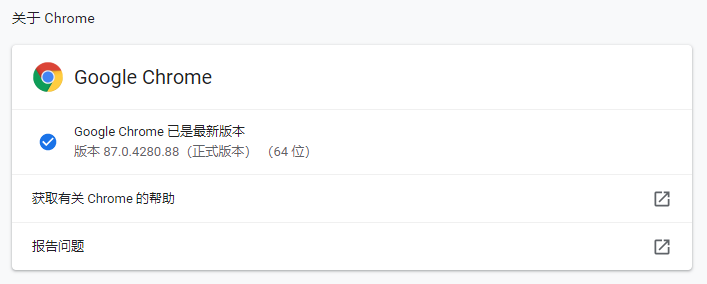
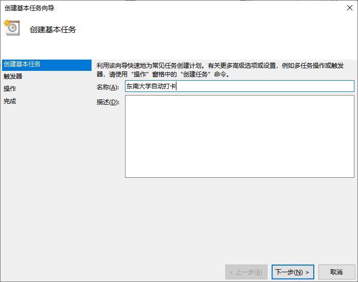
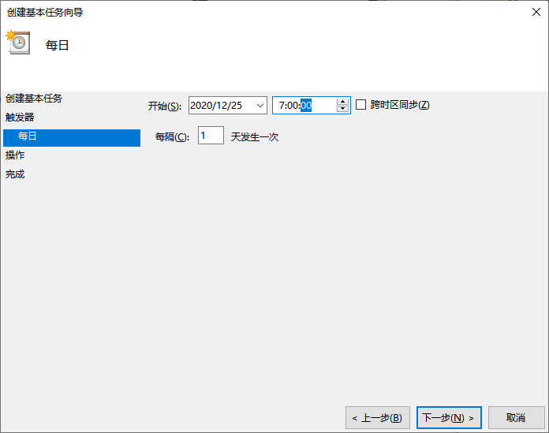
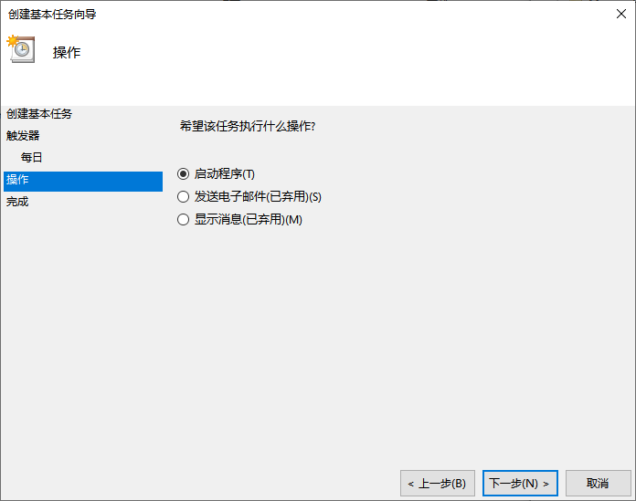
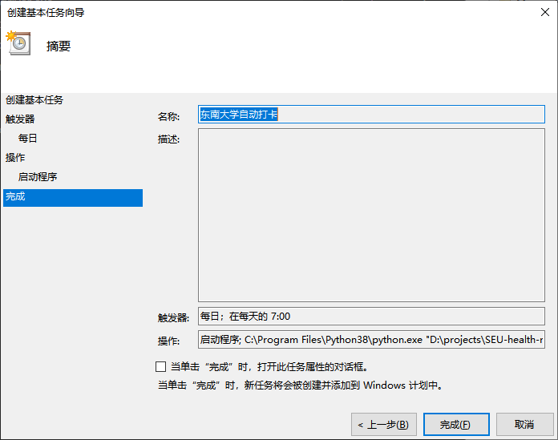
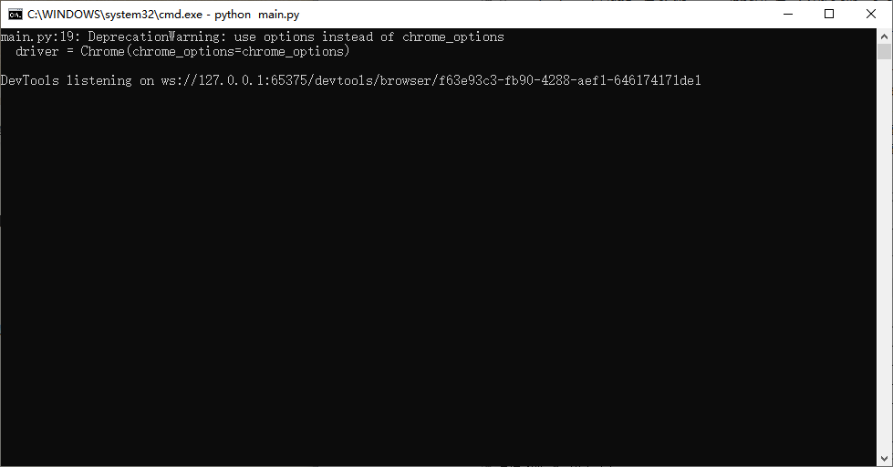
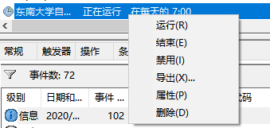
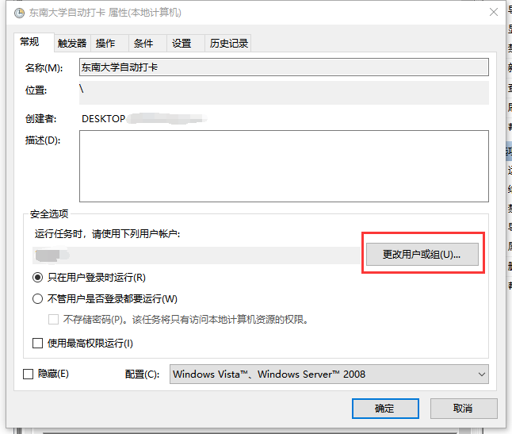
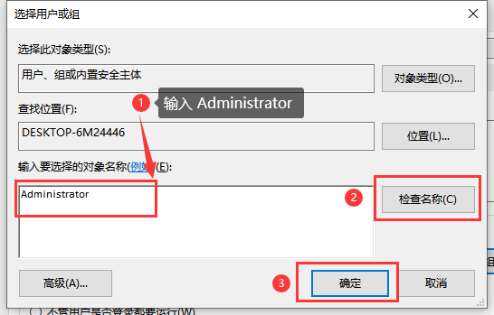

# 东南大学健康打卡助手

这是一个健康申报自动化脚本，在正确配置之后，可以实现每日自动打卡，并通过邮件告知打卡结果。

## 前提

下面的操作都在 Windows 10 的机器上执行。相关依赖有：

- [Python 3.x](https://www.python.org/)
- Chrome 浏览器
- [ChromeDriver](https://sites.google.com/a/chromium.org/chromedriver/)

脚本理论上跨平台，但暂无其他操作系统的配置演示。

## 快速上手

### 下载或 Clone 本仓库

```
git clone https://github.com/XAKK/SEU-health-reporting-helper.git
```

### 下载 ChromeDriver

项目中的 ChromeDriver 对应了 Windows 平台 87 版本的 Chrome，若本机 Chrome 版本一致则可跳过此步。



否则，下载与 Chome 浏览器版本相对应的 [ChromeDriver](https://sites.google.com/a/chromium.org/chromedriver/)，并替换 SEU-health-reporting-helper 目录下 ChromeDriver。

### 新建配置文件

在 `SEU-health-reporting-helper` 目录下，新建一个名为 `personal_infomation.py` 的文件，并写入下面的内容：

```python
class Info:
    # 发送打卡状态的邮箱地址
    # 对于东南大学邮箱，为 "name@seu.edu.cn"（name一般为你的学号）
    from_addr = "name1@example.com"
    
    # 发送打卡状态的邮箱密码
    email_password = "******"

    # 发送打卡状态的邮箱的 smtp 服务器地址
    # 对于东南大学邮箱，为 "mail.seu.edu.cn"
    smtp_server = "mail.example.com"

    # 接收打卡状态的邮箱地址
    to_addr = "name2@example.com"

    # 学号
    user_id = "220xxxxxx"

    # 登录网上办事大厅的密码
    password = "******"
```

其中，根据自己实际，替换相关内容。各字段描述如下：

| 变量名           | 描述                                                         | 样例                  |
| ---------------- | ------------------------------------------------------------ | --------------------- |
| `from_addr`      | 发送打卡状态的邮箱地址，对于东南大学邮箱，一般为 "学号@seu.edu.cn" | `"name1@example.com"` |
| `email_password` | 发送打卡状态的邮箱密码                                       | `"******"`            |
| `smtp_server`    | 发送打卡状态的邮箱的 smtp 服务器地址，对于东南大学邮箱，为 "mail.seu.edu.cn" | `"mail.example.com"`  |
| `to_addr`        | 接收打卡状态的邮箱地址                                       | `"name2@example.com"` |
| `user_id`        | 学号                                                         | `"220xxxxxx"`         |
| `password`       | 登录网上办事大厅的密码                                       | `"******"`            |

上面信息将保存在本地，不会发送给第三方，但仍建议在可信的环境部署。

至此，`SEU-health-reporting-helper` 的目录中应至少包含下面的内容：

```
├───shrh-venv/
├───chromedriver.exe
├───main.py
├───personal_information.py
├───run.bat
├───readme.access/
└───readme.md
```

### 打卡

```powershell
run.bat
```

## 每日自动打卡相关配置（Windows）

借助一台在预定义打卡时间处于运行状态的 Windows 机器，以及 Windows 任务计划程序，可以无人干预的情况下每日自动打卡。

### 打开任务计划程序

按下 `Win` + `R` ，输入`taskschd.msc`


### 创建基本任务

右键【计划程序库】，再点击【创建基本任务】


填入任务名称



### 触发器

选择每天


选择打卡时间



### 操作

选择启动程序



选择 `run.bat` 脚本，该脚本激活 Python 虚拟环境并调用 main.py。


### 完成



### 避免弹窗（可选）

测试运行上面的脚本会跳出控制台（如下图），可以继续配置避免控制台的跳出。



点击打开刚刚创建任务的【属性】



点击【更改用户或组】



将运行任务的账户改为 Administrator



最后点击确定。再次右键运行任务，任务会静默运行。


## 其他

- 脚本理论上可跨平台运行，欢迎补充其他操作系统的配置方法。
- 默认上报体温为 36.5 ℃。