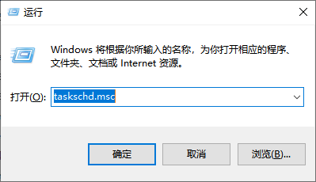
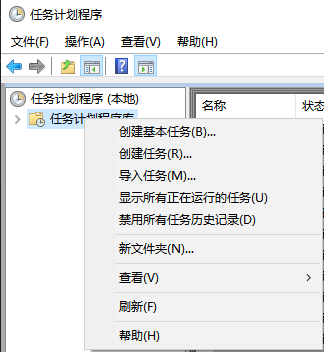
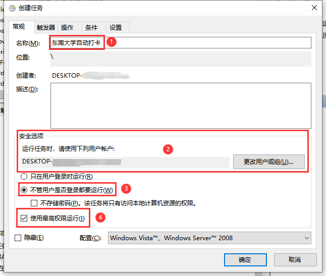
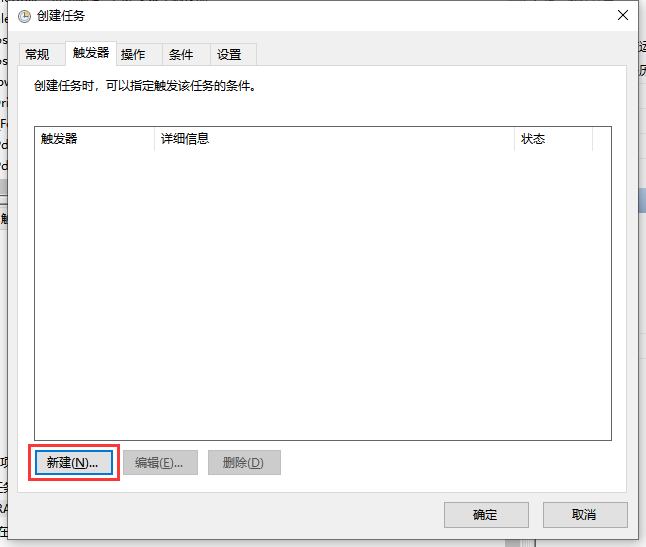
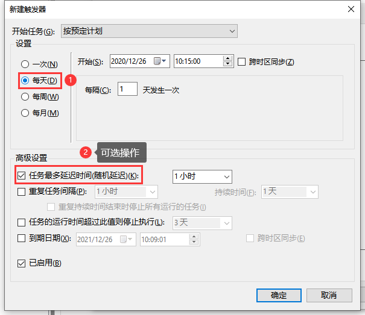
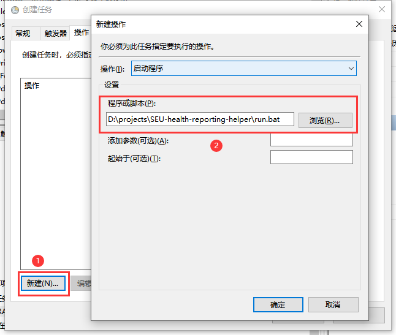

# 东南大学健康打卡助手

这是一个健康申报自动化脚本，在正确配置之后，可以实现每日自动打卡，并通过邮件告知打卡结果。

请平日自觉打卡，建议将自动打卡脚本作为兜底。**出现发烧等异常状况时，请务必在打卡脚本运行前手动申报健康状况**，以免造成信息错报。祝各位用户身体健康。

## 更新日志

**2021.11.16：**

1. 增加配置选项：是否需要通过邮件发送打卡结果;
2. 增加配置选项：是否只有在打卡失败时进行通知。


## 前提

下面的操作都在 Windows 10 的机器上执行。相关依赖有：

- [Python 3.x](https://www.python.org/)
- Chrome 浏览器
- [ChromeDriver](https://sites.google.com/chromium.org/driver/)

脚本理论上跨平台，但暂无其他操作系统的配置演示。

## 快速上手

### 下载或 Clone 本仓库

```
git clone https://github.com/XAKK/SEU-health-reporting-helper.git
```

### 下载 ChromeDriver

下载与本机 Chome 浏览器版本相对应的 ChromeDriver，并移动至 SEU-health-reporting-helper 目录下。

### 新建配置文件

`personal_information_demo.py` 是演示配置文件，可以在此基础上修改。在 `SEU-health-reporting-helper` 目录下，新建一个名为 `personal_information.py` 的文件，并写入下面的内容：

```python
class Info:
    #################### 必填 ####################
    # 学号（将 220000000 替换为您的一卡通号）
    user_id = "220000000"

    # 登录网上办事大厅的密码（将 ****** 替换为登录信息门户的密码）
    password = "******"

    #################### 可选 ####################
    # 是否需要发送邮件通知打卡结果（yes/no）
    notification = "no"

    # 只有尝试打卡失败后，才发送邮件（yes/no）
    notify_failure_only = "no"

    # 发送打卡状态的邮箱地址。对于东南大学邮箱，为 "USER_NAME@seu.edu.cn"（将 USER_NAME 替换为您的域名）
    from_addr = "USER_NAME@seu.edu.cn"
    
    # 发送打卡状态的邮箱密码（将 ****** 替换为您邮箱的密码）
    email_password = "******"

    # 发送打卡状态的邮箱的 smtp 服务器地址。对于东南大学邮箱，为 "smtp.seu.edu.cn"
    smtp_server = "smtp.seu.edu.cn"

    # 接收打卡状态的邮箱地址
    to_addr = "name@example.com"
```

其中，根据自己实际，替换相关内容。各字段描述如下：

| 变量名                | 描述                                                         | 样例                 |
| --------------------- | ------------------------------------------------------------ | -------------------- |
| `notification`        | 是否需要发送邮件通知打卡结果（yes/no），当为“no”时，除了 `user_id` 和 `passward` 外，其余变量值不再重要 | "yes"                |
| `notify_failure_only` | 只有尝试打卡失败后，才发送邮件（yes/no）                     | "yes"                |
| `from_addr`           | 发送打卡状态的邮箱地址，对于东南大学邮箱，一般为 "学号@seu.edu.cn" | `"name@example.com"` |
| `email_password`      | 发送打卡状态的邮箱密码                                       | `"******"`           |
| `smtp_server`         | 发送打卡状态的邮箱的 smtp 服务器地址，对于东南大学邮箱，为 "smtp.seu.edu.cn" | `"smtp.example.com"` |
| `to_addr`             | 接收打卡状态的邮箱地址                                       | `"name@example.com"` |
| `user_id`             | 一卡通号（9 位数）                                           | `"220xxxxxx"`        |
| `password`            | 登录网上办事大厅的密码                                       | `"******"`           |

上面信息将保存在本地，不会发送给第三方，但仍建议在可信的环境部署。

至此，`SEU-health-reporting-helper` 的目录中应至少包含下面的内容：

```
├───shrh-venv/
├───chromedriver.exe
├───main.py
├───personal_information.py
└───run.bat
```

### 打卡

```powershell
run.bat
```

## 每日自动打卡相关配置（Windows）

借助一台在预定义打卡时间处于运行状态的 Windows 机器，以及 Windows 任务计划程序，可以无人干预的情况下每日自动打卡。

### 打开任务计划程序

按下 `Win` + `R` ，输入`taskschd.msc`



### 创建任务

右键【计划程序库】，再点击【创建任务】



### 常规

1. 输入名称
2. 将安全选项中的账户改为具有相关权限的账户
3. 选择【不管用户是否登录都要运行】
4. 勾选【使用最高权限运行】




### 触发器

新建触发器



1. 将任务设置为【每天】执行
2. 配置随机延迟时间（可选）



### 操作

1. 新建操作
2. 选择启动程序（项目目录下的 `run.bat` 脚本）



### 完成

完成上面配置后，便新建了一个计划任务。

### 测试

建议进行两个测试：

1. 右键任务，点击运行进行测试；
2. 设置一个近期的时间点，在未登录机器的情况下进行测试

正常情况下，该任务**不会弹出控制台**，**用户未登录也能下自动执行**，**能够将打卡结果通过邮件发送**。

## 其他

- 默认上报体温为 36.5 ℃。